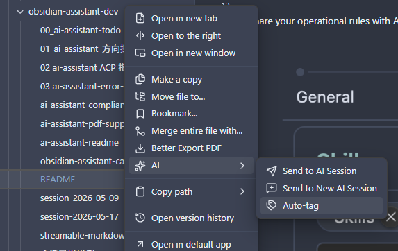
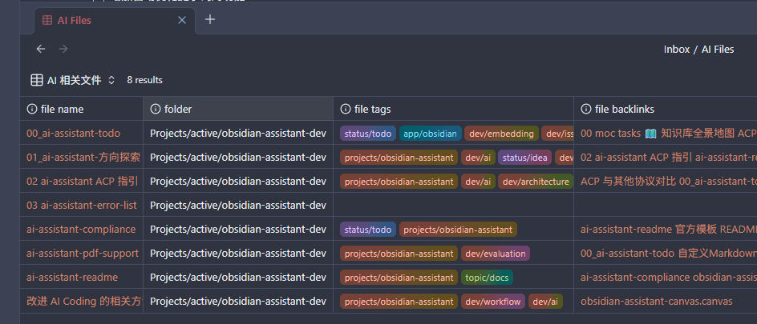
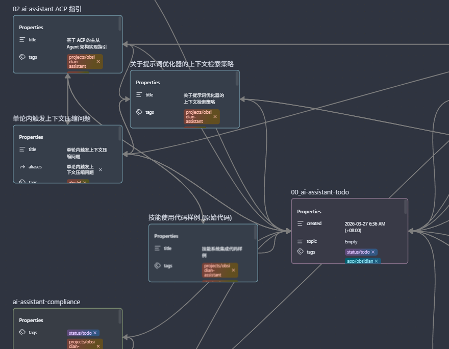
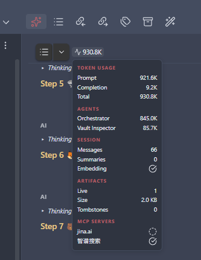
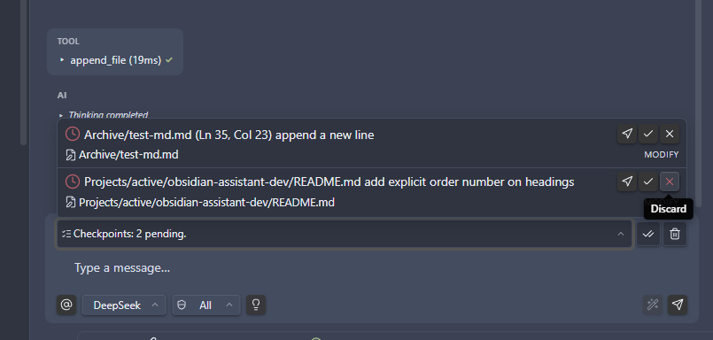
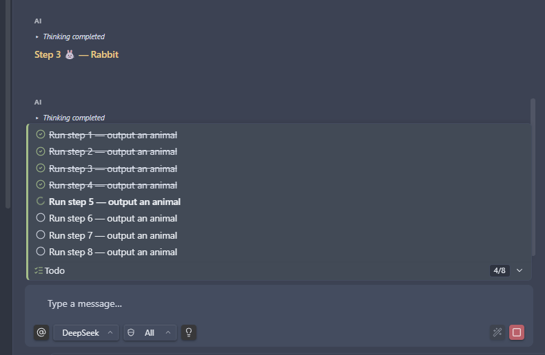
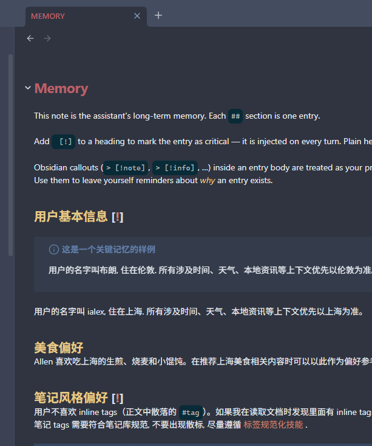
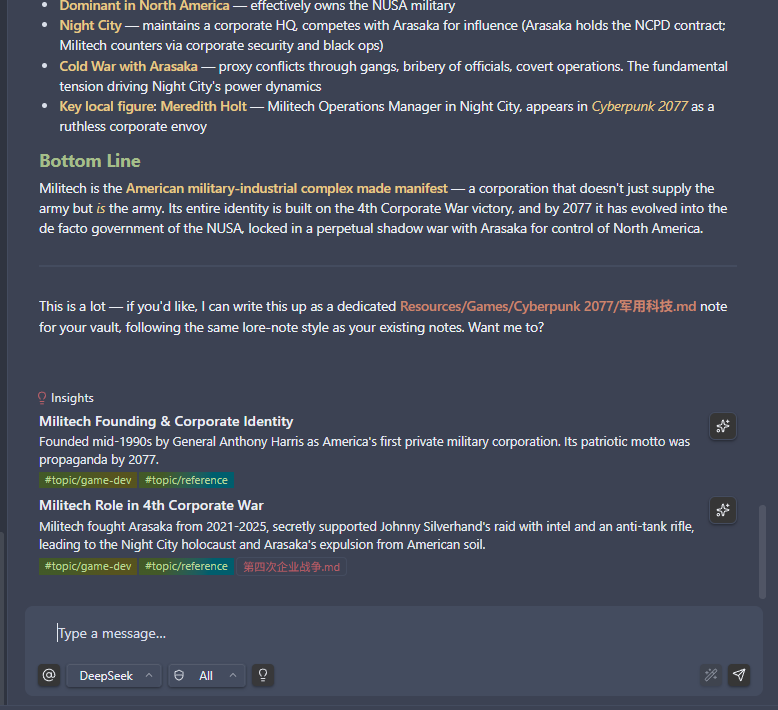
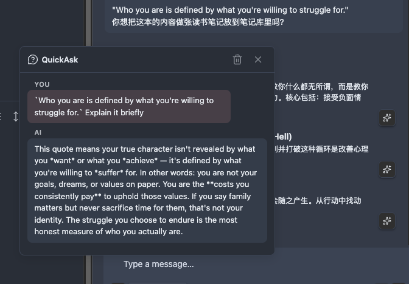

# Note Mate

A vault-connected sidebar assistant: persistent chat that searches and drafts with you, customisable editor shortcuts, sub-agent delegation, plus checkpoints so you review or rewind AI edits cleanly.

It's an [Obsidian](https://obsidian.md) plugin. Plug in AI accounts you already use, chat beside your notes, pull in vault context, polish text where the cursor sits, and rewind changes when needed—still inside Obsidian.

## What it does for you

### Deep vault tooling

**Notebook access**

Under **Settings → Note Mate → Tools**, turn on the **vault tools** you want (**tool permissions**). From chat—or the **AI** submenu in the file menu—the assistant can:

- **Read notes** — open by path or wiki link and quote what matters.
- **Search the vault** — find notes by text or tags and follow links between them.
- **Create & edit** — draft new notes or update existing ones; every change stays traceable.
- **Speech-to-text** — transcribe audio files directly in chat. Works with DashScope (Alibaba) and Tencent Cloud out of the box; configure your key under **Settings → Note Mate → Tools → Speech to Text** and attach audio files from your vault.
- **Auto-tag** — send a note to chat so the assistant can add tags that match your vault's conventions.

**Bases & Canvas**

Beyond markdown, the assistant understands Obsidian **Bases** (`.base`) and **Canvas** (`.canvas`) files. Point it at an existing file or describe what you want in plain language—it can draft valid structure: table views and filters for Bases, card layouts and connections for Canvas, ready to open in Obsidian.

### Sub-agent delegation

When a task needs specialised handling—searching the web, inspecting your vault, rewriting a long note, or running a script—the assistant delegates to a **sub-agent** built for that job. Built-in agents include:

- **Vault Inspector** — read, search, and list vault content with full read-only access.
- **Vault Editor** — rewrite an entire note body without bloating the main conversation context.
- **Web Search** — search the internet, fetch pages, and skim RSS feeds for research tasks.
- **Code Executor** — run short JavaScript snippets for calculations or data reshaping (disabled by default, opt-in).

The orchestrator routes each task to the right agent, and delegation bubbles in chat show which agent handled each step. The **Web Search** and **Code Executor** agents can be toggled individually in settings.

### Custom agents (experimental)

Define your own sub-agents under **Settings → Note Mate → Agents**. Each custom agent gets an inline system prompt, a description, a target model override (pick a different provider per agent), and an enable/disable toggle. Built-in agents are shown in a read-only card so you can inspect their configuration alongside your own.

### AGENT.md project guidance

The plugin reads an `AGENT.md` file from your vault (configurable under **Settings → Note Mate → General**) and appends it to the system prompt for that vault. Use it for per-project AI instructions—coding conventions, writing style, domain knowledge—that apply across every conversation. Changes to the file are picked up automatically as you edit.

### Custom menu & editor shortcuts

Define your own AI actions in a vault note (`MENU.md` by default). Each entry appears under the **AI** submenu when you right-click in the editor or on a file—polish, explain, expand, translate, summarise, and more. The default template ships with sensible starters; edit the note to add, remove, or tweak actions. Manage the note path under **Settings → Note Mate → General**.

Right from the editor and file menu:

- **Custom actions** — one-click prompts built from your selection, cursor position, or the open file.
- **Send to AI session** — push the open file—plus cursor or selection—into chat for deeper back-and-forth.
- **Send to new session** — same as above, but starts a fresh conversation first.
- **AI Edit History** — browse AI-driven edits across sessions.

In the chat sidebar:

- **Edit a message** — fix a typo or adjust a prompt, then re-send without copy-paste.
- **Refine prompt** — polish your draft before sending, using the previous turn for context when helpful.
- **Context at a glance** — a ring in the input toolbar shows how much of the model's context window is in use; click for token and session details, including cached prompt token savings.
- **Image paste** — paste images from the clipboard into the chat input; they'll be sent as message content or saved to the vault on demand.
- **Pinned prompt bar** — when you scroll up in a conversation, your active prompt pins to the top so you can reference it without losing your place.

### Checkpoints

When the assistant edits vault files during chat, each round becomes a **checkpoint**. Review what changed, jump to the message that triggered it, then **accept** to keep the edits or **discard** to restore files from snapshots. **Accept all** clears a batch in one go when you trust the whole set. Touched files stay locked until you decide—even across sessions—so unreviewed AI changes don't collide with new ones. A badge on the session switcher reminds you when checkpoints are still pending.

### Todo

When a task will take several steps, the assistant decides on its own whether to build a **todo plan**—breaking the work into ordered steps, re-reading that list between tool calls, and marking progress as it goes. That keeps longer jobs on track instead of drifting or skipping substeps. The plan is pinned in chat so you can follow along too.

### Memory

Turn on **Memory** under **Settings → Note Mate → Memory** when you want the assistant to remember facts across sessions. Everything lives in a **memory note** in your vault—plain markdown you can open, read, and edit like any other note. The assistant picks up your changes on the next turn. Optionally enable **auto-extract** to distill durable facts from replies into the note automatically.

### Insights & follow-up suggestions

After a reply, optional cards surface takeaway angles—new vantage points, sharper questions, hooks worth promoting into notes. The goal is fresher momentum, not circling what you already said. **Follow-up suggestions** appear as quick-pick chips below the assistant's reply, offering one-click next questions to keep the conversation moving forward.

### QuickAsk

Click the **Ask** button on any assistant bubble to open a floating panel for a follow-up question—one shot, no tools, no streaming. The side conversation stays anchored to that message without adding to the main context, so you can dig deeper into a single reply without derailing the session.

### Models and accounts

Add your own keys: **OpenAI-compatible** endpoints (including OpenAI, Azure OpenAI, and comparable hosts), **Anthropic (Claude)**, **Google Gemini**, and saved **profiles** so switching models isn't rewriting forms each time. Vendor logos and model icons in the profile picker make it easy to spot what you're using. Each assistant bubble shows the model name that generated the response.

### Optional extras (when you turn them on)

- **Lookups** — Web search, open a page from a URL, skim feeds—useful for research next to notes.
- **Images** — generate pictures with Gemini, Qwen, OpenAI (DALL·E), or Seedream (ByteDance) and drop them straight into your vault. Click any generated image for a full-screen preview with pinch-to-zoom and pan. Adjust JPEG quality under **Settings → Note Mate → Image** to balance fidelity against file size.
- **Richer tooling** — connect **MCP** servers for capabilities your admin or community provides.
- **Skills** — reusable instruction packs loaded from folders you choose—great for repeatable workflows. Skills can be disabled individually via frontmatter; disabled skills are dimmed in the details modal.
- **Embeddings** (**experimental**) — connect an embedding provider so **tools** and **skills** can be relevance-ranked before entering the prompt, saving tokens. Vault-wide semantic search is **not** here yet; whole-library search "by meaning" is **planned / TBD**. Expect drift as this settles.
- **JavaScript snippets** (**experimental**) — run short scripts from chat for arithmetic or reshaping pasted text when enabled (via the Code Executor sub-agent). Executes through the plugin, **not** a hardened sandbox; expect sizeable shifts between releases.

**Platforms & languages:** Runs on desktop and mobile (**Windows**, **macOS**, **Linux**, **iOS**, **Android**).  
UI copy ships in **English**, **日本語**, **한국어**, **简体中文**, and **繁體中文**—defaults follow locale; overrides live in plugin settings.

## Installation

### Community plugins (recommended)

1. In Obsidian, open **Settings → Community plugins**.
2. Search **Note Mate**, then choose **Install** and **Enable**.

### Manual install

1. Download `main.js`, `styles.css`, and `manifest.json` from the [latest release](https://github.com/ialex32x/ai-note-mate/releases).
2. Inside your vault, create `.obsidian/plugins/ai-note-mate/` if it doesn't exist.
3. Copy those three files into that folder.
4. Reload Obsidian and enable the plugin under **Settings → Community plugins**.

## First-time setup

1. Open **Settings → Note Mate**.
2. Under **General**, pick your active **text generation** profile (or add one first under **LLM**).
3. Add at least one **LLM** profile: an **OpenAI-compatible** endpoint, **Anthropic**, or **Gemini**, plus your model and key.
4. Optionally wire integrations—you can skip these until you need them:
   - **Image** — saves generated visuals into your vault when enabled. Supports Gemini, Qwen, OpenAI (DALL·E), and Seedream (ByteDance) backends.
   - **Embeddings** (**experimental**) — provider needed for embedding-based **tool/skill** filtering (saves tokens). Not for vault-wide semantic search yet; that mode is **planned / TBD**.
   - **Tools** — MCP servers, built-in web lookup toggles, and **tool permissions** for vault moves. Speech-to-text setup for DashScope or Tencent Cloud.
   - **Skills** — folders where optional instruction bundles live on disk.
   - **Agents** (**experimental**) — define custom sub-agents with per-agent profiles and tool sets, plus toggle built-in agents (Web Search, Code Executor).
   - **Memory** — long-term facts stored in a vault note you control.
   - **Menu note** — path to `MENU.md` (or your own file) for custom right-click actions; create from the default template if you haven't yet.
   - **Save as note directory** — default folder for exporting a session to a vault note without a prompt each time.

## Building from source

For people who want to compile the plugin locally:

- **Needs:** Node.js 18+ and npm.
- **Install:** `npm install`
- **Build:** `npm run build` (or `npm run dev` for watch mode)
- **Checks:** `npm run lint` and `npm run test`

## License

[MIT License](./LICENSE)

## Author

[ialex32x](https://github.com/ialex32x)

## Support

If this plugin helps your daily notes, consider [buying me a coffee](https://buymeacoffee.com/ialex32x).
